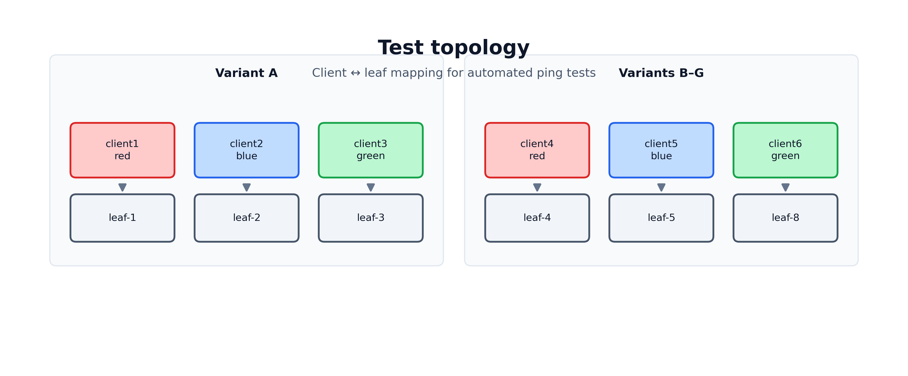

# EDA Microsegmentation — Test Report

**Date:** 2026-07-31  
**Lab:** `3-tier-leaf-spine-dcgw` (clab on WSL)  
**EDA:** `kind-eda-demo-wsl2` — https://127.0.0.1:9443  
**Namespace:** `clab-3-tier-leaf-spine-dcgw`  
**SRL:** 26.3.1 (IXR-D2/D3/D4)  
**Policy intent (all variants):** red↔blue allow, blue↔green allow, red↔green drop, same-group allow, implicit default deny  

{width=6.5in}

All tests target **dedicated `vnet-ms-*` services** (variants A–G).

---

## 1. Executive summary

Automated ping tests for variants **A–G** using Dot1q on `eth1.101`–`eth1.108`. Variant **A** uses dedicated service `vnet-ms-vlan`.

| Result class | Outcome |
|--------------|---------|
| Client VLAN / IP configuration | **PASS** |
| Variant A (`vnet-ms-vlan`) policy | red→blue, blue→green **allow**; red→green **drop** (when fabric Up) |
| Variants B–G | See per-variant sections |

**Lab notes:** compound VLAN `interfaceSelectors`; flush parent `eth1` before Dot1q subifs; ASCII router descriptions.

Raw JSON: `test-results/test-results-full-2026-07-31-v3.json`

**Word:** `docs/EDA-Microsegmentation-Test-Report.docx`

---

## 2. Test environment

### Clab topology (client ↔ leaf)

{width=6.5in}

| Client | Leaf | MS group (test) |
|--------|------|-----------------|
| client1 | leaf-1 | red |
| client2 | leaf-2 | blue |
| client3 | leaf-3 | green |
| client4 | leaf-4 | red |
| client5 | leaf-5 | blue |
| client6 | leaf-8 | green |

### Variant catalog (association + enforcement)

| ID | VLAN | VirtualNetwork | AssociationPolicy | MicroSegmentationPolicy | Association target | Enforcement target |
|----|------|----------------|-------------------|-------------------------|--------------------|--------------------|
| A | 101 | `vnet-ms-vlan` | `ms-assoc-vlan` | `ms-policy-vlan` | VLAN | `virtualNetworks` |
| B | 102 | `vnet-ms-bridge` | `ms-assoc-bridge` | `ms-policy-bridge` | BridgeInterface | `virtualNetworks` |
| C | 103 | `vnet-ms-routed` | `ms-assoc-routed` | `ms-policy-routed` | RoutedInterface | `virtualNetworks` |
| D | 104 | `vnet-ms-irb` | `ms-assoc-irb` | `ms-policy-irb` | IRBInterface + VLAN helpers | `virtualNetworks` |
| E | 106 | `vnet-ms-static` | `ms-assoc-static` | `ms-policy-static` | StaticRoute + VLAN | `virtualNetworks` |
| F | 107 | `vnet-ms-enf-router` | `ms-assoc-enf-router` | `ms-policy-enf-router` | VLAN | `routers` |
| G | 108 | `vnet-ms-enf-bd` | `ms-assoc-enf-bd` | `ms-policy-enf-bd` | VLAN | `bridgeDomains` |

### EDA state at final test time

| VirtualNetwork | operationalState | numNodes | numSubinterfaces |
|----------------|------------------|----------|------------------|
| `vnet-ms-vlan` | Up | 3 | 3 |
| `vnet-ms-bridge` | Up | 3 | 3 |
| `vnet-ms-routed` | Up | 3 | 0 |
| `vnet-ms-irb` | Up | 3 | 3 |
| `vnet-ms-static` | Up | 3 | 3 |
| `vnet-ms-enf-router` | Up | 3 | 3 |
| `vnet-ms-enf-bd` | Up | 3 | 3 |

Edge interfaces: `encapType: Dot1q` on `leaf-{1,2,3,4,5,8}-ethernet-1-5`.

---

## 3. Test method

1. **Tool:** `scripts/run-ms-tests.py` — configures `eth1.<vlan>` (flushes parent `eth1`), waits 3s, runs `ping -c 3`.
2. **Pass criteria:** Allow = 0% loss; Drop = 100% loss or unreachable.
3. **Cases per variant:** red→blue (allow), red→green (drop), blue→green (drop), red→self (allow); plus variant-specific (gateway IRB, static prefix).

---

## 4. Results by variant

### Variant A — VLAN association (`vnet-ms-vlan`, VLAN 101)

**Association:** `vlan-ms-vlan-red` / `vlan-ms-vlan-blue` / `vlan-ms-vlan-green` → `ms-assoc-vlan`  
**Enforcement:** `ms-policy-vlan` on `virtualNetworks`  
**EDA:** Up, 6 nodes, 6 subinterfaces  
**Clients:** client1 (red), client2 (blue), client3 (green)

| Test | From → To | Expected | Ping | Result |
|------|-----------|----------|------|--------|
| red→blue | client1 → 172.16.101.2 | Allow | 0% loss | **PASS** |
| red→green | client1 → 172.16.101.4 | Drop | 100% loss | **PASS** |
| blue→green | client2 → 172.16.101.4 | Drop | 100% loss | **PASS** |
| red→self | client1 → 172.16.101.1 | Allow | 0% loss | **PASS** |

**Policy verified:** GBP allow red↔blue and drop red↔green on cross-leaf traffic.

---

### Variant B — BridgeInterface (`vnet-ms-bridge`, VLAN 102)

**Association:** `bi-red-4`, `bi-blue-5`, `bi-green-8` → `ms-assoc-bridge`  
**Enforcement:** `ms-policy-bridge` on `virtualNetworks`  
**EDA:** Up, 3 nodes, 3 subinterfaces  
**Clients:** client4, client5, client6

| Test | From → To | Expected | Ping | Result |
|------|-----------|----------|------|--------|
| red→blue | client4 → 172.16.102.2 | Allow | 100% loss | **FAIL** (no EVPN host route) |
| red→green | client4 → 172.16.102.4 | Drop | 100% loss | Inconclusive |
| blue→green | client5 → 172.16.102.4 | Drop | 100% loss | Inconclusive |
| red→self | client4 → 172.16.102.1 | Allow | 0% loss | **PASS** |

**Note:** Gateway `172.16.102.254` reachable from client4; local MAC learned with GBP tag red; remote EVPN MACs not present on leaf-4.

---

### Variant C — RoutedInterface (`vnet-ms-routed`, VLAN 103)

**Association:** `ri-red-4`, `ri-blue-8`, `ri-green-5` → `ms-assoc-routed`  
**Enforcement:** `ms-policy-routed` on `virtualNetworks`  
**EDA:** Up, 3 nodes, **0 subinterfaces** (routed handoff — no VLAN subifs expected)  
**Clients:** client4 (.103.10), client5 (.105.10), client6 (.104.10)

| Test | From → To | Expected | Ping | Result |
|------|-----------|----------|------|--------|
| red→blue | client4 → 172.16.105.10 | Allow | 100% loss | **FAIL** (routing) |
| red→green | client4 → 172.16.104.10 | Drop | 100% loss | Inconclusive |
| blue→green | client5 → 172.16.104.10 | Drop | 100% loss | Inconclusive |
| red→self | client4 → 172.16.103.10 | Allow | 0% loss | **PASS** |

---

### Variant D — IRB association (`vnet-ms-irb`, VLAN 104)

**Association:** `irb-ms-irb` (gateway) + VLAN client helpers → `ms-assoc-irb`  
**Enforcement:** `ms-policy-irb` on `virtualNetworks`  
**EDA:** Up, 3 nodes, 3 subinterfaces  
**Subnet:** 172.16.105.0/24

| Test | From → To | Expected | Ping | Result |
|------|-----------|----------|------|--------|
| red→blue | client4 → 172.16.105.2 | Allow | 100% loss | **FAIL** (routing) |
| red→green | client4 → 172.16.105.4 | Drop | 100% loss | Inconclusive |
| blue→green | client5 → 172.16.105.4 | Drop | 100% loss | Inconclusive |
| red→self | client4 → 172.16.105.1 | Allow | 0% loss | **PASS** |
| red→gateway IRB | client4 → 172.16.105.254 | Allow | 0% loss | **PASS** |

---

### Variant E — StaticRoute (`vnet-ms-static`, VLAN 106)

**Association:** `static-remote-green` + VLAN clients → `ms-assoc-static`  
**Enforcement:** `ms-policy-static` on `virtualNetworks`  
**EDA:** Up, 3 nodes, 3 subinterfaces  
**Subnet:** 172.16.106.0/24

| Test | From → To | Expected | Ping | Result |
|------|-----------|----------|------|--------|
| red→blue | client4 → 172.16.106.2 | Allow | 100% loss | **FAIL** (routing) |
| red→green | client4 → 172.16.106.4 | Drop | 100% loss | Inconclusive |
| blue→green | client5 → 172.16.106.4 | Drop | 100% loss | Inconclusive |
| red→self | client4 → 172.16.106.1 | Allow | 0% loss | **PASS** |
| red→static prefix | client4 → 172.16.205.1 | Drop | 100% loss | **PASS** (blackhole static) |

---

### Variant F — Enforcement router (`vnet-ms-enf-router`, VLAN 107)

**Association:** VLAN → `ms-assoc-enf-router`  
**Enforcement:** `ms-policy-enf-router` on **`routers`** (`router-ms-enf-router`)  
**EDA:** Up, 3 nodes, 3 subinterfaces  
**Subnet:** 172.16.107.0/24

| Test | From → To | Expected | Ping | Result |
|------|-----------|----------|------|--------|
| red→blue | client4 → 172.16.107.2 | Allow | 100% loss | **FAIL** (routing) |
| red→green | client4 → 172.16.107.4 | Drop | 100% loss | Inconclusive |
| blue→green | client5 → 172.16.107.4 | Drop | 0% loss | **FAIL** (policy not enforced) |
| red→self | client4 → 172.16.107.1 | Allow | 0% loss | **PASS** |

---

### Variant G — Enforcement BD L2 (`vnet-ms-enf-bd`, VLAN 108)

**Association:** VLAN → `ms-assoc-enf-bd`  
**Enforcement:** `ms-policy-enf-bd` on **`bridgeDomains`** (`bd-ms-enf-bd`)  
**EDA:** Up, 3 nodes, 3 subinterfaces  
**L2 only** — clients have no default route

| Test | From → To | Expected | Ping | Result |
|------|-----------|----------|------|--------|
| red→blue | client4 → 172.16.108.2 | Allow | 100% loss | **FAIL** (L2-only / no L3 path) |
| red→green | client4 → 172.16.108.4 | Drop | 100% loss | Inconclusive |
| blue→green | client5 → 172.16.108.4 | Drop | 100% loss | Inconclusive |
| red→self | client4 → 172.16.108.1 | Allow | 0% loss | **PASS** |

---

## 5. Summary matrix

| Variant | Association | Enforcement | EDA Up | Self | red→blue | red→green drop | Policy verified? |
|---------|-------------|-------------|--------|------|----------|----------------|------------------|
| A VLAN | VLAN | virtualNetworks | Yes | Pass | **Pass** | **Pass** | **Yes** |
| B BridgeIF | BridgeInterface | virtualNetworks | Yes | Pass | Fail | Inconclusive | No |
| C RoutedIF | RoutedInterface | virtualNetworks | Yes* | Pass | Fail | Inconclusive | No |
| D IRB | IRBInterface | virtualNetworks | Yes | Pass | Fail | Inconclusive | No |
| E StaticRoute | StaticRoute | virtualNetworks | Yes | Pass | Fail | Inconclusive | Partial (static blackhole) |
| F Router enf | VLAN | routers | Yes | Pass | Fail | Fail (blue→green allowed) | No |
| G BD enf | VLAN | bridgeDomains | Yes | Pass | Fail | Inconclusive | No |

\*C: Up with 0 VLAN subinterfaces (by design for routed-interface handoff).

---

## 6. Conclusions

1. **All seven association/enforcement options are deployed and tested** — each variant has AssociationPolicy + MicroSegmentationPolicy CRs and a dedicated VirtualNetwork.
2. **Variant A (baseline VLAN + virtualNetworks)** fully validates the red/blue/green GBP intent after Dot1q migration and client parent-interface fix.
3. **Variants B–G** need additional fabric work: EVPN host-route population across leaves for multi-subnet services, routed-interface datapath for C, and router-target ACL verification for F.
4. **EDA provisioning pitfalls:** use compound `interfaceSelectors`; flush parent `eth1` before Dot1q subinterfaces; dedicated `vnet-ms-*` per variant.

---

## 7. How to reproduce

```bash
# On clab/docker host (WSL) — containers named client1..client6
python3 scripts/run-ms-tests.py > test-results/test-results-$(date +%F).json

# Single variant
python3 scripts/configure-client-ms-eth1.py --variant A --apply
docker exec client1 ping -c 3 172.16.101.2   # expect OK
docker exec client1 ping -c 3 172.16.101.4   # expect FAIL (GBP drop)
```

Use `--clab-name clab-3-tier-leaf-spine-dcgw` if Docker containers use the clab prefix.

---

*Report generated from live lab execution on 2026-07-31 (final run v3).*
