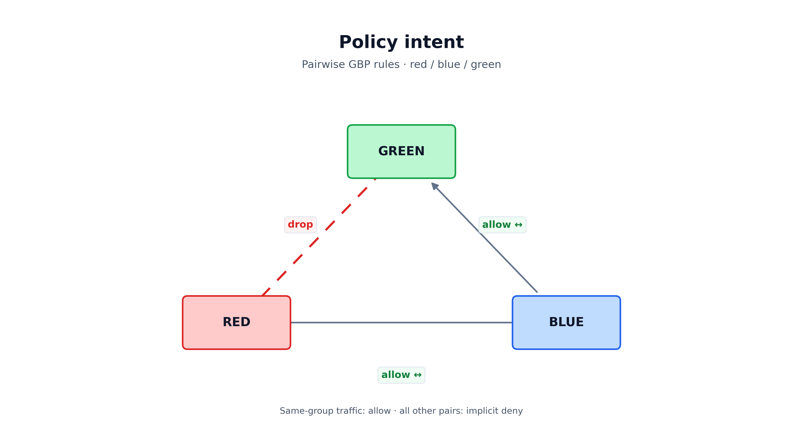
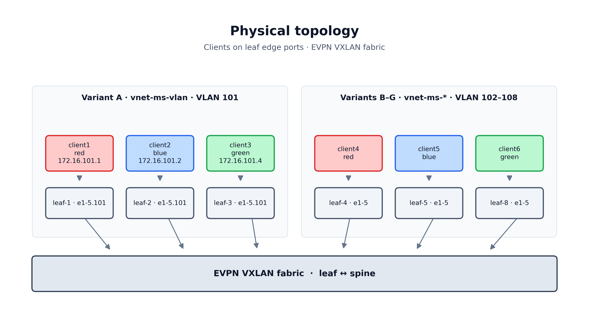
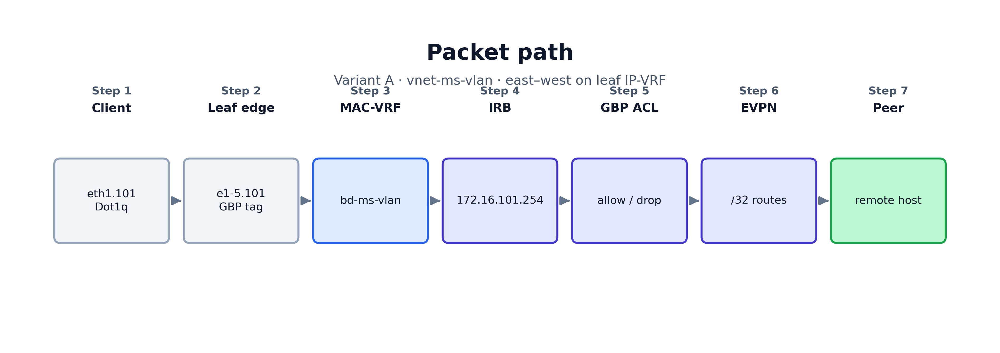
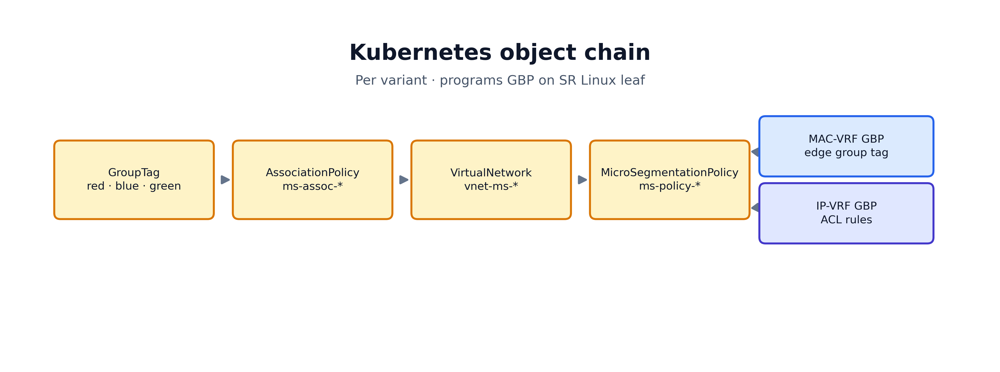
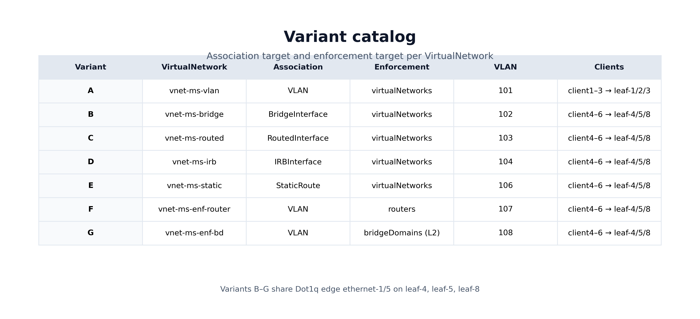

# EDA Microsegmentation

**Environment:** WSL EDA (`kind-eda-demo-wsl2`) — UI https://127.0.0.1:9443  
**Namespace:** `clab-3-tier-leaf-spine-dcgw`  
**Services:** Seven dedicated `vnet-ms-*` VirtualNetworks (variants A–G)

---

## 1. Purpose

Microsegmentation divides an internal L3 service into **security groups** and enforces **east–west** rules between them. In this lab:

- **Red** can talk to **Blue**
- **Blue** can talk to **Green**
- **Red** cannot talk to **Green**
- All other cross-group traffic is denied by default (zero-trust)

This uses Nokia EDA’s **microsegmentation** application, which programs **Group-Based Policy (GBP)** on SR Linux 26.3+ (7220 IXR-D2/D3) leaf nodes.

{width=6.5in}

The diagram uses a **triangle** layout: each edge is one pairwise relationship — allow on red↔blue and blue↔green, drop on red↔green.

---

## 2. Architecture overview (Variant A / `vnet-ms-vlan`)

Traffic is classified on the client edge port in the MAC-VRF, then filtered by a group-based ACL on the L3 router before forwarding locally or across EVPN.

### Physical topology

{width=6.5in}

### Packet path (Variant A)

{width=6.5in}

### Kubernetes object chain (per variant)

{width=6.5in}

---

## 3. The four Kubernetes objects

### 3.1 GroupTag

Defines logical segments: `red`, `blue`, `green`.

| Field | Value |
|-------|--------|
| API | `microsegmentation.eda.nokia.com/v1alpha1` |
| Kind | `GroupTag` |
| Scope | `Local` (per VirtualNetwork scope; IDs from `group-tag-pool-local`) |

### 3.2 AssociationPolicy

Maps GroupTags to **network resources** inside each `vnet-ms-*` service.

**Variant A example** (`ms-assoc-vlan` on `vnet-ms-vlan`):

| VLAN object | GroupTag |
|-------------|----------|
| `vlan-ms-vlan-red` | red |
| `vlan-ms-vlan-blue` | blue |
| `vlan-ms-vlan-green` | green |

EDA associates the tag with the **VLAN + bridge attachment** so SRL programs GBP on the edge subinterface.

### 3.3 VirtualNetwork (`vnet-ms-vlan` — Variant A)

| Component | Name | Details |
|-----------|------|---------|
| Bridge domain | `bd-ms-vlan` | EVPN VXLAN, MAC learning |
| Router | `router-ms-vlan` | IP-VRF, `nodeSelectors: [eda.nokia.com/role=leaf]` |
| IRB | `irb-ms-vlan` | `172.16.75.254/24` |
| VLANs | `vlan-ms-vlan-red/blue/green` | VLAN **75**, compound `interfaceSelectors` |

**Host route populate** (required for multi-leaf same-subnet):

```yaml
hostRoutePopulate:
  dynamic: { populate: true }
  evpn: { populate: true, datapathProgramming: true }
  static: { populate: true }
```

### 3.4 MicroSegmentationPolicy (`ms-policy-vlan`)

Ordered rules — **first match wins**:

| Order | Source | Destination | Action |
|-------|--------|-------------|--------|
| 1–3 | same group | same group | Accept |
| 4 | red | blue | Accept |
| 5 | blue | green | Accept |
| 6 | red | green | Drop |
| 7 | * | * | Drop (implicit deny) |

`bidirectional: true` generates reverse ACL entries on the switch.

```yaml
serviceTargets:
  virtualNetworks:
    - vnet-ms-vlan
```

### 3.5 Rule design — minimal allows, explicit combinations, and logging

GBP evaluates each packet against **source group + destination group** (not hop-by-hop). Rules are **ordered**; the **first match wins**. `bidirectional: true` programs the reverse direction on the switch (e.g. red → blue also covers blue → red).

#### Minimal cross-group policy (smallest enforceable set)

For the chain intent (red ↔ blue, blue ↔ green, red ↔ green blocked), only **two allow entries** are required:

| Entry | Match | Action | Covers (with `bidirectional: true`) |
|-------|--------|--------|-------------------------------------|
| 1 | red → blue | Accept | red ↔ blue |
| 2 | blue → green | Accept | blue ↔ green |

Anything else — including **red ↔ green** and **green ↔ red** — falls through to deny. GBP is **not transitive**: red → blue and blue → green allowed does **not** allow red → green.

Add **same-group** allow entries (red ↔ red, blue ↔ blue, green ↔ green) only if you need intra-group or self traffic; the two cross-group rules do not cover them.

#### What the lab policy adds beyond the minimum

The generated policies (`variants/gen-microsegmentation-policies.py`) use a **richer** entry list on purpose:

| Entry | Enforcement need | Why keep it |
|-------|------------------|-------------|
| Same-group × 3 | Required for self / intra-group pings in tests | Not redundant with cross-group allows |
| red ↔ blue, blue ↔ green | Core chain | Minimum cross-group set |
| **red ↔ green Drop** | **Not required** for correctness (implicit deny already blocks) | **Explicit combination** for operations |
| **default deny** (`match: {}`) | May be required by the platform to program a terminal deny on SRL | Catch-all for any pair not listed above |

#### Why an explicit deny can still be a valid combination

An explicit **red → green Drop** duplicates the outcome of implicit deny, but it is still useful when you want that **pair** to be visible and measurable:

| Benefit | Explanation |
|---------|-------------|
| **Entry counters** | EDA UI → Policy → **Entry Counters** show hits on that rule, not buried in a generic catch-all |
| **Logging** | `action.log: true` on a specific Drop entry surfaces blocked red → green attempts in logs without logging every other denied pair |
| **Intent in the CR** | Operators see “block red ↔ green” in the policy object without inferring from absence of allows |
| **Ordering** | Placed **before** the catch-all, it wins first for that pair — useful if the catch-all is ever broadened |

In the generator, the red ↔ green rule uses `log: true`; allows and the default deny use `log: false` to avoid noise.

#### Logging — when to enable it

| Pattern | Typical `log` | Rationale |
|---------|---------------|-----------|
| Cross-group **Allow** (red ↔ blue) | `false` | High volume; counters (`collectStats: true`) usually enough |
| **Explicit Drop** for a sensitive pair (red ↔ green) | `true` | Security signal: prove the deny is firing and aid troubleshooting |
| **Default deny** catch-all | `false` | Would flood logs with every unexpected flow |
| Gateway / IRB entries (variant D) | per entry | Log gateway violations separately from host-to-host rules |

`collectStats: true` on each entry is low-cost and complements logging: use counters for volume, logging for exceptions you care about.

#### Valid combination summary

| Goal | Suggested entries |
|------|-------------------|
| **Leanest cross-group** | 2 allows (red↔blue, blue↔green) + platform deny |
| **Lab / connectivity tests** | + 3 same-group allows |
| **Auditable deny of red ↔ green** | + explicit red↔green Drop with `log: true` (redundant for enforcement, valid for ops) |
| **Explicit zero-trust tail** | + `match: {}` Drop as last entry |
| **Gateway-centric (IRB variant)** | + red/blue/green ↔ gateway allows **before** host rules |

Choose **minimal allows** for simplicity; add **explicit combinations** when counters, logs, or readable policy intent matter more than the shortest YAML.

---

## 4. Lab endpoint mapping (Variant A)

| Group | Container | Leaf | Edge port | IPv4 |
|-------|-----------|------|-----------|------|
| Red | client1 | leaf-1 | ethernet-1/5 | 172.16.75.1/24 |
| Blue | client2 | leaf-2 | ethernet-1/5 | 172.16.75.2/24 |
| Green | client3 | leaf-3 | ethernet-1/5 | 172.16.75.4/24 |

Gateway: `172.16.75.254` on VLAN **75** (`eth1.75`).

Interface labels: `eda.nokia.com/ms-group=red|blue|green` and `eda.nokia.com/vnet-ms-vlan=bd-ms-vlan`.

Variants **B-G** use client4/5/6 on leaf-5/6/7 only (same-leaf-set validation; no cross-DC tests).

---

## 5. Packet walkthrough (Variant A)

### Red → Blue (allowed)

1. client1 sends ICMP to `172.16.75.2` via gateway `172.16.75.254`.
2. On leaf-1, source traffic from `ethernet-1/5.75` is group **red**.
3. `router-ms-vlan` has host route `172.16.75.2/32` (EVPN).
4. GBP ACL: red → blue → **Accept**.
5. Ping succeeds.

### Red → Green (blocked)

GBP ACL: red → green → **Drop**.

### Blue → Green (allowed)

GBP ACL: blue → green → **Accept**.

---

## 6. Where policy is applied

| Location | Applied? |
|----------|----------|
| MAC-VRF (`bd-ms-*`) on each **leaf** | Yes — group tag on edge subinterface |
| IP-VRF (`router-ms-*`) on each **leaf** | Yes — GBP ACL |
| Fabric underlay (`default` NI) | No — BGP only |
| Other `vnet-ms-*` services | No — separate VirtualNetwork scope |

---

## 7. Expected behaviour matrix

| Source → Destination | Result |
|----------------------|--------|
| red ↔ blue | Allow |
| blue ↔ green | Allow |
| red ↔ green | Drop |
| green ↔ red | Drop (implicit deny) |
| same group | Allow |
| Host → gateway | Allow |

---

## 8. Validation

```bash
python3 scripts/configure-client-ms-eth1.py --variant A --apply
docker exec client1 ping -c 3 172.16.75.2   # red→blue OK
docker exec client2 ping -c 3 172.16.75.4 # blue→green OK
docker exec client1 ping -c 3 172.16.75.4 # red→green FAIL
```

**EDA UI:** Microsegmentation → Policies → `ms-policy-vlan` → Entry Counters.

---

## 9. Deploy

```bash
cd variants && bash apply-all.sh && bash apply-dot1q.sh
```

---

## 10. Troubleshooting

| Symptom | Check |
|---------|--------|
| Policy on but red↔blue fails | VLAN subif on leaf; parent `eth1` must not hold the IP (use `eth1.75`) |
| Tags missing on switch | AssociationPolicy VLAN targets; interface `ms-group` + `vnet-ms-vlan` labels |
| VNet not Up | `kubectl get virtualnetwork vnet-ms-vlan -n clab-3-tier-leaf-spine-dcgw` |

---

## 11. Artifact files

| Path | Purpose |
|------|---------|
| `variants/virtualnetworks.yaml` | All seven `vnet-ms-*` services |
| `variants/association-policies.yaml` | Per-variant AssociationPolicy |
| `variants/microsegmentation-policies.yaml` | Per-variant MicroSegmentationPolicy |
| `variants/edge-interfaces-dot1q.yaml` | Dot1q + MS labels on edge ports |
| `variants/apply-dot1q.sh` | Apply edge + vnets + policies |
| `scripts/configure-client-ms-eth1.py` | Client VLAN/IP switcher |
| `scripts/run-ms-tests.py` | Automated test suite A–G |
| `variants/README.md` | Full service catalog |
| `docs/diagrams/generate_diagrams.py` | Regenerate PNG diagrams for docs |

---

## 12. Association and enforcement options (full catalog)

Microsegmentation uses two independent choices:

1. **Where endpoints get a GroupTag** — `AssociationPolicy.associationTargets`
2. **Where the GBP ACL is applied** — `MicroSegmentationPolicy.serviceTargets`

### 12.1 Association targets

| Target | Typical use |
|--------|-------------|
| **VLAN** | Variant **A** — `vnet-ms-vlan` |
| **BridgeInterface** | Variant **B** — `vnet-ms-bridge` |
| **RoutedInterface** | Variant **C** — `vnet-ms-routed` |
| **IRBInterface** | Variant **D** — `vnet-ms-irb` |
| **StaticRoute** | Variant **E** — `vnet-ms-static` |

### 12.2 Enforcement targets

| Target | Typical use |
|--------|-------------|
| **VirtualNetwork** | Variants A–E — recommended |
| **Router** | Variant **F** — `vnet-ms-enf-router` |
| **BridgeDomain** | Variant **G** — `vnet-ms-enf-bd` (L2 only) |

### 12.3 Lab variant services

{width=6.5in}

| ID | VirtualNetwork | Association | Enforcement |
|----|----------------|-------------|-------------|
| A | `vnet-ms-vlan` | VLAN | `virtualNetworks` |
| B | `vnet-ms-bridge` | BridgeInterface | `virtualNetworks` |
| C | `vnet-ms-routed` | RoutedInterface | `virtualNetworks` |
| D | `vnet-ms-irb` | IRBInterface | `virtualNetworks` |
| E | `vnet-ms-static` | StaticRoute | `virtualNetworks` |
| F | `vnet-ms-enf-router` | VLAN | `routers` |
| G | `vnet-ms-enf-bd` | VLAN | `bridgeDomains` |

**Port sharing:** Variant A uses leaf-1/2/3 (VLAN **75**); variants B-G use leaf-5/6/7 (VLANs **75, 80/81/82, 85, 90, 100, 110**) on the same `ethernet-1/5` (Dot1q). See physical topology diagram in §2.

---


## 14. Architecture + Variant Glossary

### 14.1 Architecture flow (operator view)

- `VirtualNetwork` builds the service path with `bridgeDomain`/`vlan` at the edge and `irbInterface`/`routedInterface`/`router` for L3 handling.
- Interface labels are applied on edge Interface CRs in `variants/edge-interfaces-dot1q.yaml` (notably `eda.nokia.com/ms-group` plus `eda.nokia.com/vnet-ms-*`).
- `AssociationPolicy` translates those resource targets into `GroupTag` identities used by GBP.
- `MicroSegmentationPolicy` enforces the matrix with allow/deny entries on defined `serviceTargets`: `virtualNetworks`, `routers`, or `bridgeDomains`.

### 14.2 Variant glossary (A-G)

- **A**: VLAN targets, enforced on `virtualNetworks` (`vnet-ms-vlan`), tested on leaf-1/2/3.
- **B**: BridgeInterface targets, enforced on `virtualNetworks` (`vnet-ms-bridge`), tested on leaf-5/6/7.
  - **Lab note:** `bridgeInterfaceSelectors` on parent Interface labels did not program GBP tags on `ethernet-1/5.75`. Explicit `bridgeInterfaces` in `ms-assoc-bridge` (`bi-red-5`, `bi-blue-6`, `bi-green-7`) are required for leaf5/6/7 and client5/6/7 mapping. Reference: `docs/manifests/ms-assoc-bridge-patch.yaml`.

- **C**: RoutedInterface targets, enforced on `virtualNetworks` (`vnet-ms-routed`), tested on leaf-5/6/7.
- **D**: IRB-focused segmentation (`gateway` + endpoint groups), enforced on `virtualNetworks` (`vnet-ms-irb`), tested on **leaf-2=blue, leaf-3=green, leaf-4=red**.
- **E**: StaticRoute + segmentation checks, enforced on `virtualNetworks` (`vnet-ms-static`), tested on **leaf-6=blue, leaf-7=green, leaf-8=red**.
- **F**: `router` serviceTarget enforcement (`router-ms-enf-router`) with VLAN association, tested on leaf-5/6/7.
- **G**: `bridgeDomain` serviceTarget enforcement (`bd-ms-enf-bd`, L2) with VLAN association, tested on leaf-5/6/7.

**Scope:** no across-DC test path is implemented yet; validation currently covers the listed leaf sets only.

## 13. Test results

See `docs/EDA-Microsegmentation-Test-Report.md` for automated ping results per variant.

---

*Document version: dedicated vnet-ms-* services, July 2026*


